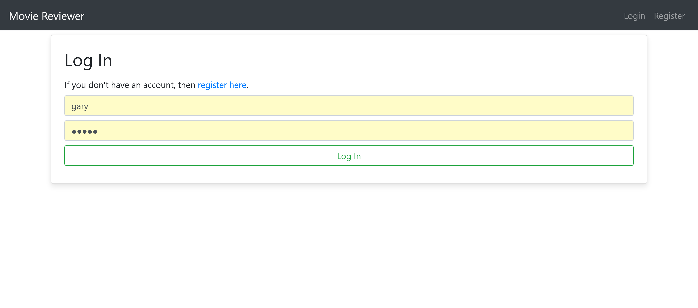
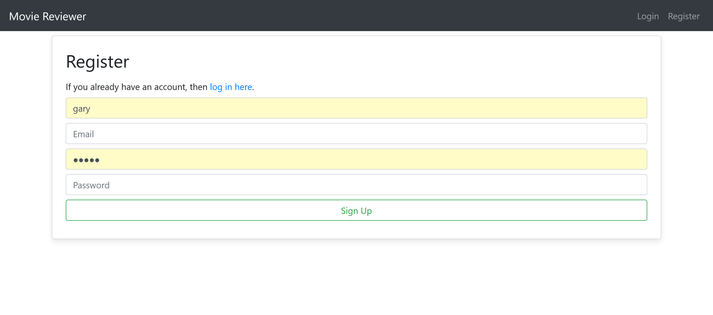
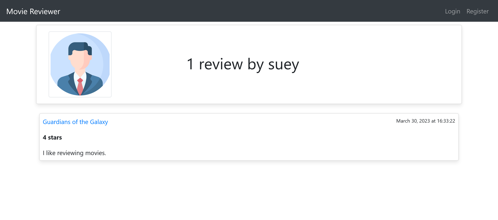
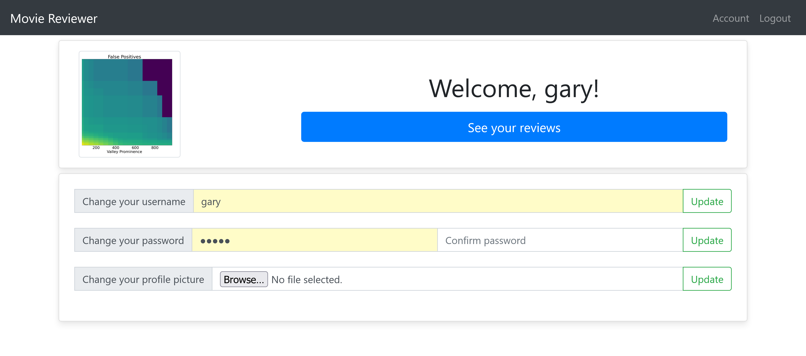
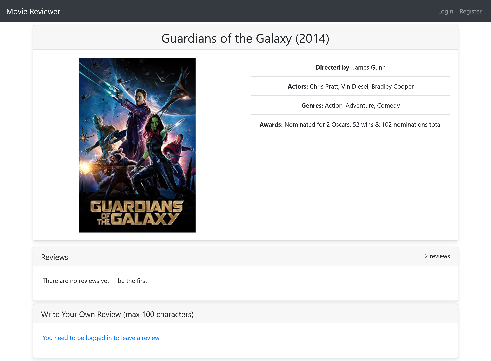
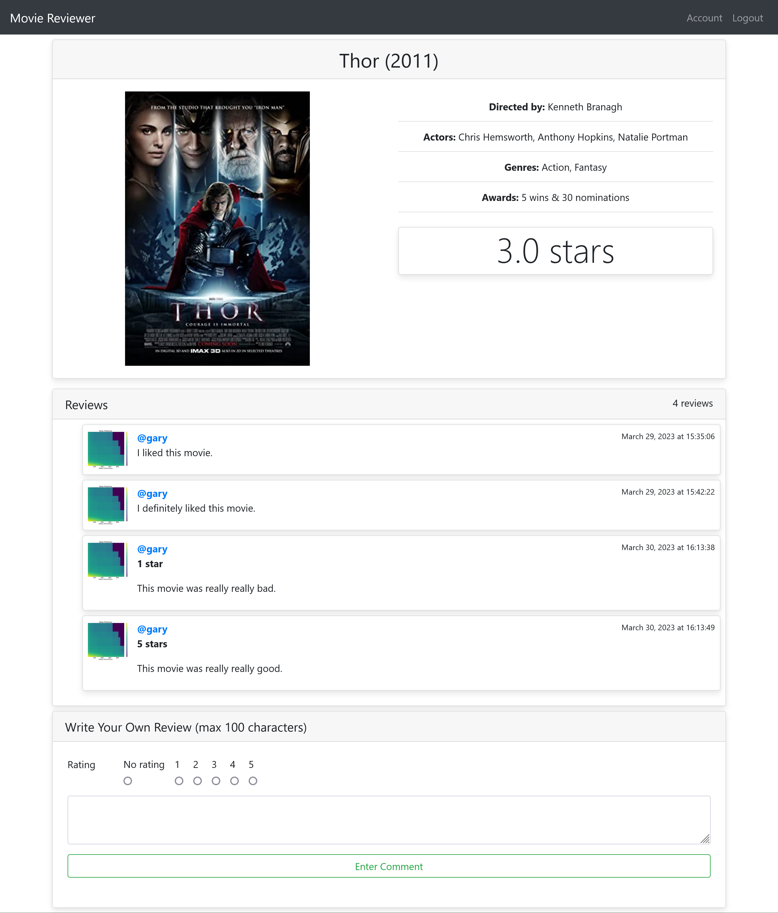

# Extra Credit

## Layout Improvements

Updated the layout of all of the web pages, generally moving information inside of Bootstrap cards and making sure that elements were aligned with each other. 

For movies without a poster I have set up a default poster image, and for accounts without a profile picture I have set up a default profile pic; both are located in the folder `/static/images`.

In various places I also set profile pictures up so they are displayed in a manner where they are cropped to maintain a consistent size regardless of the aspect ratio of the original image, and for most of the forms with a few inputs, I moved the inputs to a single line (see the accounts page).

While every part of the layout was changed, the most dramatic change was done in the movie query results display, which I changed to be a flex container which shows each icon in their own card, which expand when hovered over (and each card is in its entirety a link to the associated movie).

On the movie detail page, I also display placeholder text in the review box if the user is not logged in, and placeholder text if the list of reviews if there are no reviews to show.

(Ignore the fact that it says max 100 characters; I made a typo and don't feel like re-exporting the screenshots)

Finally, I fixed plurality issues with various text (e.g. on the movie details page, if there is only a single review the page says '1 review' instead of '1 reviews').

*I may have forgotten some other minor things I did, since I forgot to document my changes as I made them, whoops.*

## Additional Features

### Online Database Hosting

I'm hosting the database using MongoDB Atlas, meaning it's actually persistent between different users (you should be able to see the accounts I made and comments I left above when you run my code).

### Featured Movies

On the home page, there is a carousel which shows a set of featured movies, which contiuously changes over time; in the future, one could have the featured movies as part of a database (at the moment, it is hardcoded into the website).

### Password Update Form

In the `account` page, I added a form to allow the user to update their password, with the same validation used for the password in the registration page (see above).

### Links to Reviews

If you click on a link on the user_detail page for a given user, it should take you specifically to their associated review within the list of reviews on the movie's page (though this is only really obvious when there are a ton of reviews on the movie's page).

### Star Ratings

I added a cursory implementation of a star rating system; on the page for a given movie, along with their text review, a person has the option to provide a one through five star rating. If there is at least one review with a star rating, the average rating among all of the reviewers is displayed on the movie's detail page, as well as shown on the query results page (see picture of query results above).

In the future, I would hope to improve the input and display of the ratings, e.g. using stars rather than a radio input and numerical display.

---

Given these changes, I think it is reasonable to ask for full extra credit.
